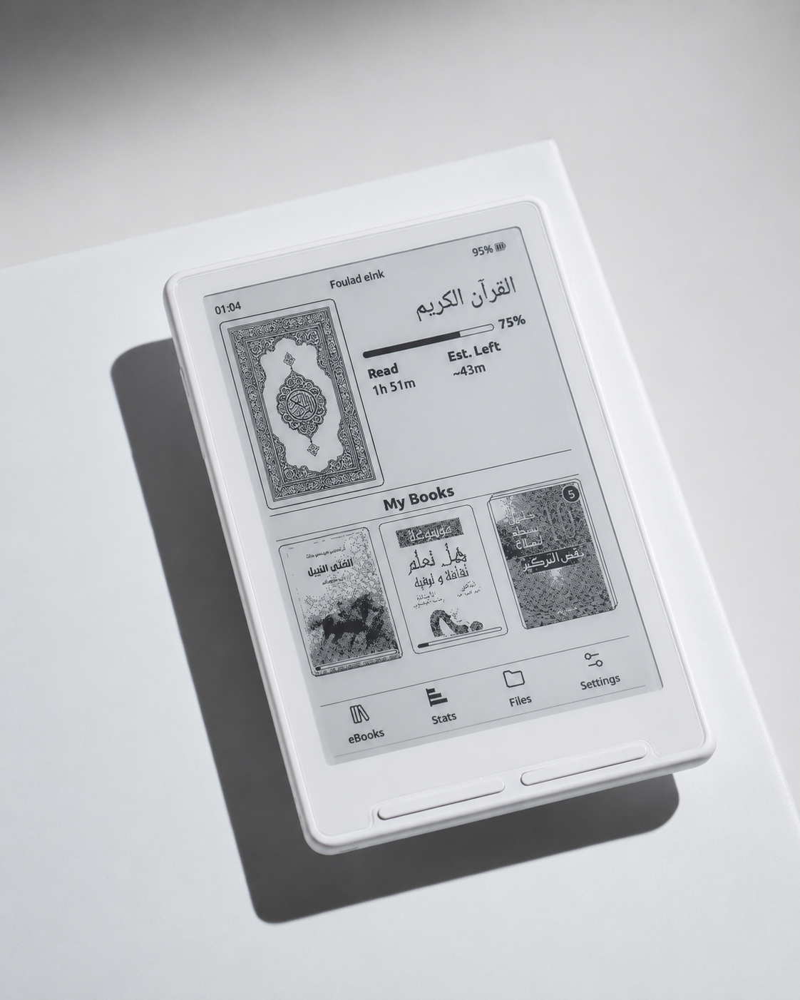
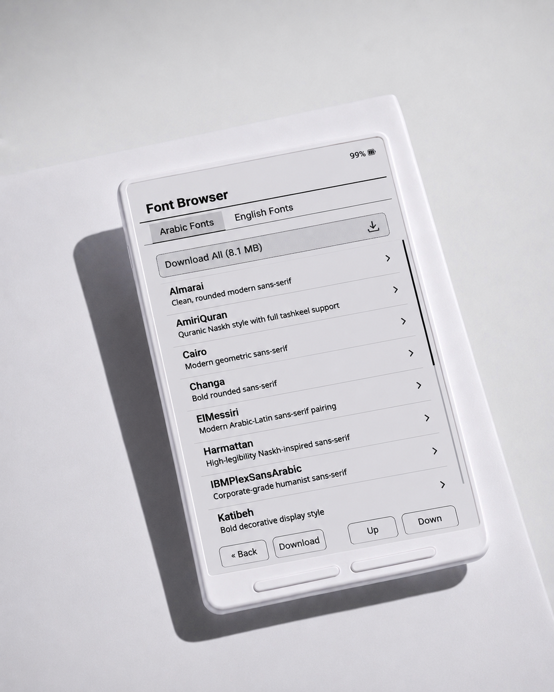
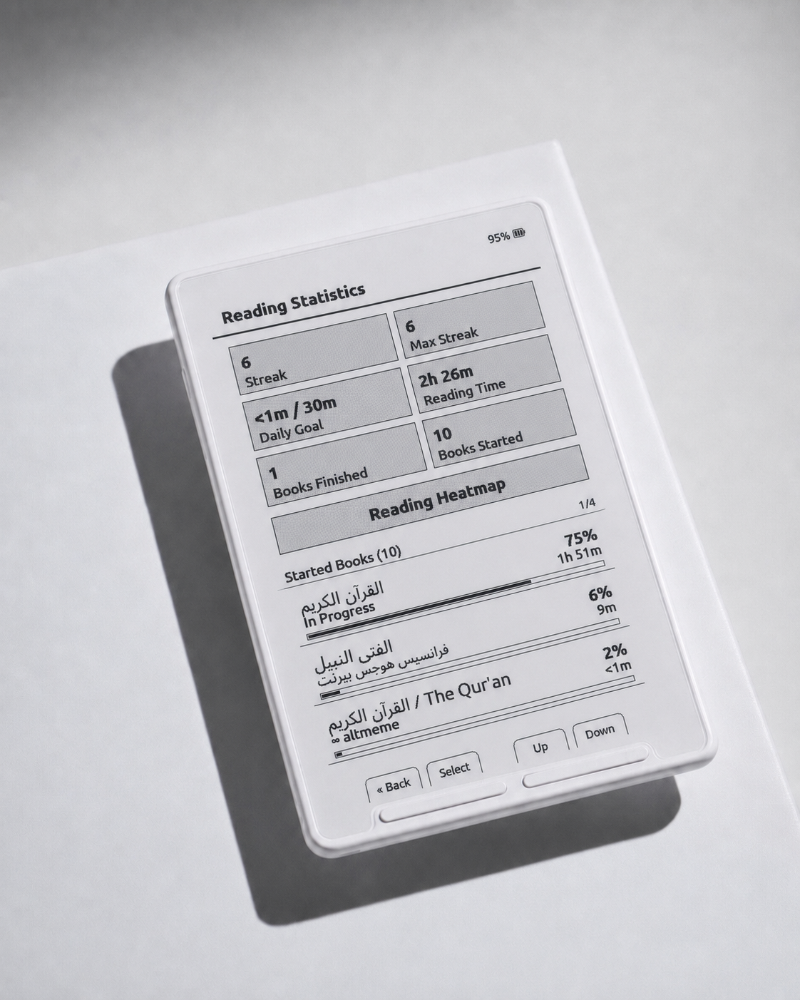
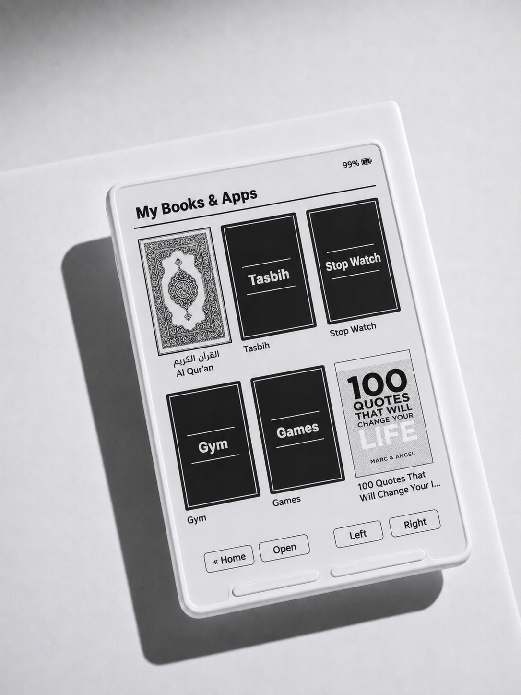
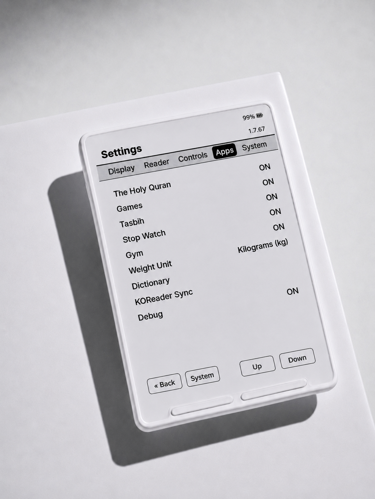
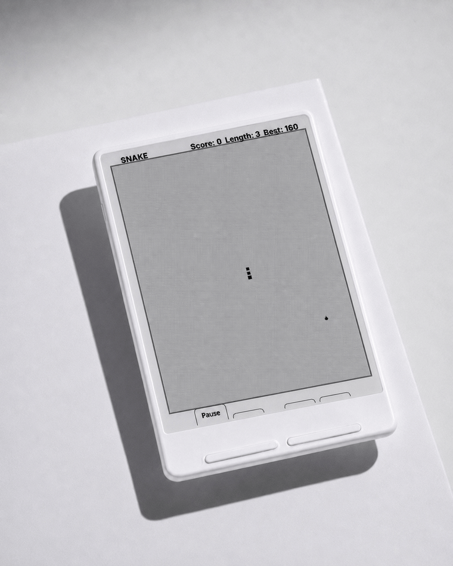
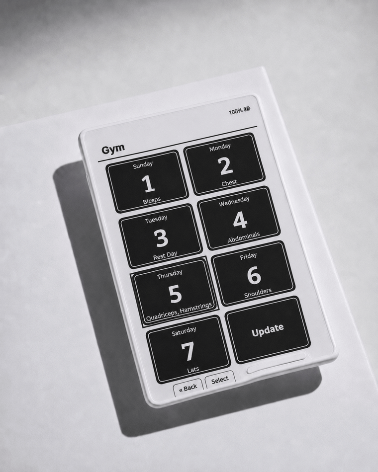
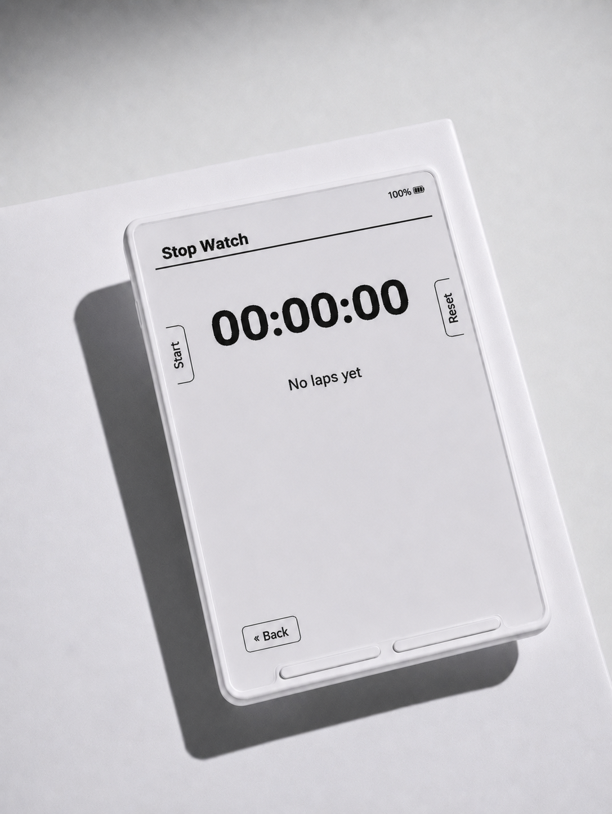
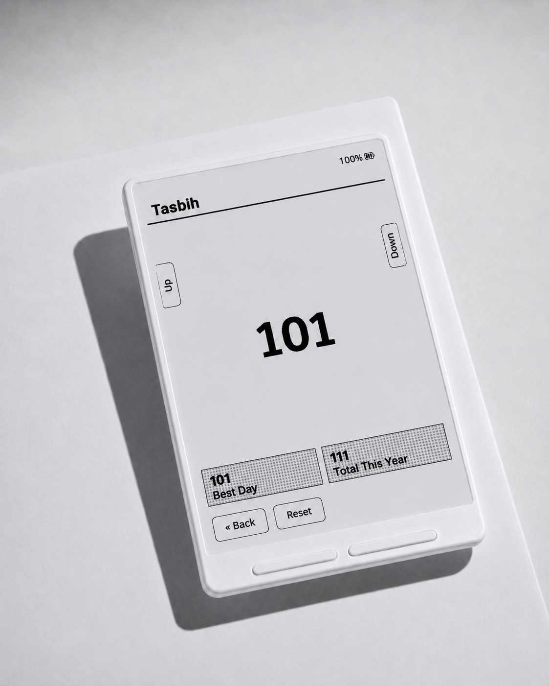
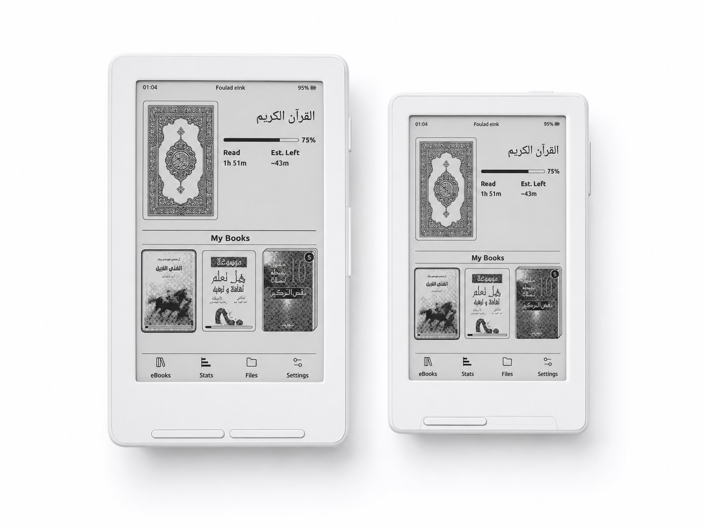

<h1 align="center">📖 Foulad eInk</h1>
<p align="center"><b>An e-reader built around Arabic.</b></p>
<p align="center">
  Foulad eInk is a free, open-source firmware for Xteink e-ink readers — a fork of
  <a href="https://github.com/crosspoint-reader/crosspoint-reader">CrossPoint Reader</a>, rebuilt so Arabic, and the
  languages that share its script, read the way they're supposed to. It updates itself over the air, straight from
  this repository.
</p>
<p align="center">
  <i>📱 Runs on Xteink <a href="https://www.xteink.com/products/xteink-x4">X4</a> and
  <a href="https://www.xteink.com/products/xteink-x3">X3</a>.</i>
</p>

<p align="center">
  <a href="https://github.com/sfoulad/foulad-eink/releases"></a>
  <a href="./LICENSE"></a>
  
  
</p>

<p align="center">
  <sub>
    ✨ <a href="#highlights">Highlights</a> &nbsp;·&nbsp;
    📋 <a href="#what-can-it-do">Everything it does</a> &nbsp;·&nbsp;
    🚀 <a href="#install-firmware">Install</a> &nbsp;·&nbsp;
    🔤 <a href="#custom-sd-card-fonts">Fonts</a> &nbsp;·&nbsp;
    🛠️ <a href="#development">Development</a>
  </sub>
</p>

<br>

<p align="center">
  
</p>
<h3 align="center">🏠 Everything, from one screen.</h3>
<p align="center">
  Pick up where you left off, browse your library, and check your reading stats — a home screen designed to get out
  of your way.
</p>

<br>

<p align="center">
  
</p>
<h3 align="center">🕌 Reads Arabic like it was made for it.</h3>
<p align="center">
  Correct letter shaping, right-to-left layout, and a bundled Quran in full Uthmani script with proper ayah markers.
  The same engine reads Persian, Ottoman Turkish, and Kurdish text correctly too.
</p>

<br>

<p align="center">
  
</p>
<h3 align="center">🔤 Download fonts, Arabic and English, on the go.</h3>
<p align="center">
  Browse and download font families for both scripts straight over Wi-Fi — no SD card swap, no computer required.
</p>

<br>

<p align="center">
  
</p>
<h3 align="center">📊 See your reading, at a glance.</h3>
<p align="center">
  Daily streaks, a monthly heatmap, and per-book progress — set a daily goal and watch it add up.
</p>

<br>

<p align="center">
  
</p>
<h3 align="center">📚 Books and apps, in one place.</h3>
<p align="center">
  Every book sits in the same grid as Tasbih, Stop Watch, Gym, and Games — no separate launcher, no digging through menus.
</p>

<br>

<p align="center">
  
</p>
<h3 align="center">🎛️ Enable and disable apps, to taste.</h3>
<p align="center">
  Don't want Games or Gym cluttering your library? Turn off whatever you don't use, right from Settings — Apps.
</p>

<br>

<p align="center">
  
</p>
<h3 align="center">🎮 Four games, zero downloads.</h3>
<p align="center">
  Snake, Tetris, Sudoku, and Maze, built right into the firmware — pinned in My Books & Apps for whenever you want a
  break from reading.
</p>

<br>

<p align="center">
  
</p>
<h3 align="center">🏋️ Plan your week, log every set.</h3>
<p align="center">
  A 7-day workout split with a day at a glance — muscle group, exercise count, rest days — then a per-set logger
  that remembers your last weight and reps, and shows the exercise photo right on the page.
</p>

<br>

<p align="center">
  
</p>
<h3 align="center">⏱️ Every second, on the dot.</h3>
<p align="center">
  Start, pause, and lap tracking with a Casio-style MM:SS:CS display — pinned right alongside your books.
</p>

<br>

<p align="center">
  
</p>
<h3 align="center">📿 Count your dhikr, track your best day.</h3>
<p align="center">
  Either side button counts — no need to look away from your recitation — with a running total for the year and
  your all-time best day, plus a flash at 33, 99, and 100.
</p>

<br>

<p align="center">
  
</p>
<h3 align="center">📱 One firmware, both devices.</h3>
<p align="center">
  Foulad eInk runs natively on the Xteink X4 and X3, adapting to each device's screen and buttons automatically.
</p>

<br>

---

<h2 id="highlights">✨ Highlights</h2>

- 🕌 **A fully Arabic interface** — mirrored, translated, and with page-turn buttons that swap direction automatically so "forward" is always where your thumb expects it.
- 🌍 **Reads Arabic, Persian, Ottoman Turkish, and Kurdish correctly** — proper letter shaping and right-to-left text, everywhere it shows up.
- 📖 **A bundled Quran** — Uthmani script, ayah and surah markers, and justified lines that stretch the way a real mushaf does.
- ☁️ **Foulad eBooks** — connect to a self-hosted library and browse it as a cover grid, right from the home screen.
- 📊 **Reading stats** — streaks, a monthly heatmap, and per-book progress.
- 🎮 **Four built-in games** — Snake, Tetris, Sudoku, and Maze.
- 🏋️ **Gym workout planner** — a 7-day split, per-set weight/reps logging, and exercise photos, synced from a shared catalog.
- 📿 **Tasbih counter, Stop Watch, and Dictionary** — a dhikr counter with daily/yearly stats, a lap-tracking stopwatch, and offline word lookup right from the reading drawer.
- 🎨 **A live Dashboard screensaver** — clock, battery, current book, streak, and a rotating ayah, instead of a static sleep screen.
- 🔋 **Free, open source, and self-updating** — flash it once, and it keeps itself up to date over Wi-Fi from here on out.

---

<h2 id="what-can-it-do">📋 What can it do?</h2>

<details>
<summary><b>See the full feature list</b> — click to expand</summary>

<br>

**🏠 Home & library**

- A hero card for the book you're reading (cover, progress bar, time read, and estimated time left), a "My Books" row of recent covers, and a bottom icon menu with physical-button hints.
- Folder browser, hidden-file toggle, long-press delete, recent books with cover thumbnails, SD-cache management.
- Native handling for `.epub`, `.xtc/.xtch`, `.txt`, and `.bmp`.

**📖 Reading**

- EPUB 2/3 rendering with embedded-style option, image handling, hyphenation, kerning, chapter navigation, footnotes, bookmarks, go-to-percent, auto page turn, orientation control, focus reading, and KOReader progress sync.
- Custom fonts — install your favorite fonts on the SD card.
- Tilt page turn (X3 only).
- Offline dictionary — select a word while reading and look it up right from the drawer, no connection needed once a dictionary is installed.

**📊 Reading statistics**

- Total and per-day reading time, a monthly heatmap of your reading activity, per-book time tracking, and a configurable daily reading goal.
- A live Dashboard sleep screen — clock, battery, current book and progress, reading streak, and a rotating Quran ayah, as an alternative to a static cover/blank sleep screen.

**🧩 Apps**

- Snake, Tetris, Sudoku, and Maze, pinned as their own tile in your library — no setup, nothing to install.
- **Gym**: a 7-day workout split shown as a day-at-a-glance grid (muscle group, exercise count, rest days), an exercise picker synced from a shared catalog, and a per-set logger that remembers your last weight/reps and shows the exercise photo on the page.
- **Tasbih**: a dhikr counter with a top-count leaderboard and daily/yearly totals.
- **Stop Watch**: start/pause, lap tracking, and a MM:SS:CS Casio-style display.

**☁️ Foulad eBooks**

- A dedicated home-screen entry that opens a self-hosted OPDS catalog directly — cover-grid browsing, search, pagination, and one-tap downloads that keep the catalog's cover art. No manual server setup beyond a one-time username/password prompt on first use.

**📶 Wireless**

- File transfer web UI
- EPUB Optimizer
- Web settings UI/API (edit many device settings from a browser)
- WebSocket fast uploads
- WebDAV handler
- AP mode (hotspot) and STA mode (join existing Wi-Fi), both with QR helpers
- Calibre wireless connect flow
- OPDS browser with saved servers (up to 8), search, pagination, and direct download
- OTA update checks and installs from this repo's GitHub releases — the updater restarts the device into a clean-memory state before downloading, so updates install reliably even after long reading sessions

**🎨 Customization**

- Sleep screen modes, front/side button remapping, status bar controls, power-button behavior, refresh cadence, sunlight fading fix, and more.

**⚙️ Under the hood**

- Lean firmware, trimmed to the two languages it's actually for (English and Arabic) and a curated font set (Noto Serif for Latin reading, Noto Naskh Arabic for Arabic) — the whole image is a few MB, which keeps OTA updates fast.
- Full English and Arabic UI localization with complete RTL support.

</details>

---

## 🔒 USB-locked devices

Some Xteink units bought from third-party stores (like AliExpress) ship with USB flashing locked from the factory.
If yours is one of them, you'll need the free **Xteink Unlocker** tool before you can flash this firmware — it's
maintained by the upstream CrossPoint project, not this fork.

> [!NOTE]
> **Bought directly from xteink.com?** You can skip this — those units aren't locked.
>
> **Not sure if yours is locked?** Just try the [web installer](#install-firmware) below first. If your browser
> can't find the device, then it's worth grabbing the unlocker.

> [!WARNING]
> If you do need the unlocker, only flash this firmware as a **"Custom .bin"** — the tool's built-in options don't
> include this fork. Flashing the wrong thing on a locked device can leave it stuck with no way to recover it, so
> follow the [Install firmware](#install-firmware) steps below exactly. Once this firmware is on the device, every
> future update comes safely over Wi-Fi — no unlocker needed again.

---

<h2 id="install-firmware">🚀 Install firmware</h2>

### 🌐 Easiest: web installer

1. Connect your device via USB-C and wake it up.
2. Download `firmware.bin` from the [Releases](https://github.com/sfoulad/foulad-eink/releases) page.
3. Open the [web flasher](https://crosspointreader.com/#flash-tools), pick your device (X3 or X4), choose **Custom
   .bin**, and upload the file. That's it.

> [!TIP]
> **After that first flash**, you'll never need a cable again — updates install straight from the device via
> Settings → OTA Update.

<details>
<summary><b>💻 Prefer the command line?</b></summary>

<br>

1. Install [`esptool`](https://github.com/espressif/esptool):

   ```bash
   pip install esptool
   ```

2. Download `firmware.bin` from the [Releases](https://github.com/sfoulad/foulad-eink/releases) page.
3. Connect your device via USB-C.
4. Find the device port. On Linux, run `dmesg` after connecting. On macOS:

   ```bash
   log stream --predicate 'subsystem == "com.apple.iokit"' --info
   ```

5. Flash it:

   ```bash
   esptool.py --chip esp32c3 --port /dev/ttyACM0 --baud 921600 write_flash 0x10000 /path/to/firmware.bin
   ```

   Adjust `/dev/ttyACM0` to match your system.

</details>

<details>
<summary><b>🔧 Building it yourself?</b></summary>

<br>

See [Development](#development) below.

</details>

---

<h2 id="custom-sd-card-fonts">🔤 Custom SD-card fonts</h2>

Want a different look for your books? Convert any TTF/OTF font into a device-ready file — no reflashing needed.

1. Open the [SD-card font builder](https://crosspointreader.com/fonts).
2. Upload up to four styles (regular, bold, italic, bold-italic), and set a name, sizes, and character range.
3. Download the generated `.cpfont` files.
4. Copy them to your SD card under `/fonts/YourFont/` (or `/.fonts/YourFont/` to keep the folder hidden).
5. Pick the font on the device from the font settings.

### 🕌 Arabic, out of the box

Book titles, author names, filenames, chapter titles, and full EPUB body text render Arabic script correctly with no
setup at all — proper letter shaping, right-to-left order, and the extra letters Persian, Ottoman Turkish, and
Kurdish add on top of the Arabic alphabet. Two Arabic fonts already ship in the firmware:

- **Noto Naskh Arabic** for reading, at every text size.
- **Noto Sans Arabic** for menus and titles.

Prefer a different Arabic look? You can swap in your own font too:

<details>
<summary>Show me how</summary>

<br>

1. Download an Arabic-capable TTF/OTF (e.g. [IBM Plex Sans Arabic](https://fonts.google.com/specimen/IBM+Plex+Sans+Arabic)).
2. Convert it locally — the hosted web builder doesn't know about this fork's Arabic support, so run the script
   directly:

   ```bash
   cd lib/EpdFont/scripts
   python3 fontconvert_sdcard.py --intervals reading,arabic --reposition-marks --name "PlexArabic" /path/to/IBMPlexSansArabic-Regular.ttf
   ```

   `--reposition-marks` is required for correct diacritics (harakat/tashkeel). Most Arabic fonts position
   combining marks using an OpenType table (GPOS) that this converter doesn't read; without the flag, marks
   commonly render overlapping each other or over the wrong letter.

3. Copy the generated `.cpfont` files to your SD card under `/fonts/PlexArabic/` (or `/.fonts/PlexArabic/`).
4. On the device: **Settings → Reader → Arabic Font** → select the family you just installed. Selecting the
   built-in font again reverts to it.

</details>

---

## 📚 Documentation

| | |
|---|---|
| 📗 [User Guide](./USER_GUIDE.md) | How to use the device day to day |
| 🌐 [Web server usage](./docs/webserver.md) | Using the built-in file-transfer/settings web UI |
| 🔌 [Web server endpoints](./docs/webserver-endpoints.md) | API reference for the web server |
| 🗺️ [Project scope](./SCOPE.md) | What this fork will and won't take on |

---

<h2 id="development">🛠️ Development</h2>

<details>
<summary><b>Prerequisites, setup, and build commands</b> — click to expand</summary>

<br>

### Prerequisites

- [pioarduino](https://github.com/pioarduino/pioarduino) or VS Code + pioarduino plugin
- Python 3.8+
- `clang-format` 21
- USB-C cable supporting data transfer

### Setup

```bash
git clone --recursive https://github.com/sfoulad/foulad-eink
cd foulad-eink

# if cloned without --recursive:
git submodule update --init --recursive
```

### Build / flash / monitor

```bash
pio run --target upload
```

### Pre-commit checks

```bash
./bin/clang-format-fix
pio check -e default
pio run -e default
pio run -t unit-tests
```

### Debugging

After flashing new changes, it's worth capturing detailed logs from the serial port. First, install the required
Python packages:

```bash
python3 -m pip install pyserial colorama matplotlib
```

Then run the monitor script:

```bash
# Linux (tested on Debian, should work on most distros)
python3 scripts/debugging_monitor.py

# macOS
python3 scripts/debugging_monitor.py /dev/cu.usbmodem2101
```

Minor adjustments may be needed on Windows.

</details>

<details>
<summary><b>⚙️ How the caching works internally</b> — for the curious</summary>

<br>

This firmware is aggressive about caching data down to the SD card to keep RAM usage low — the ESP32-C3 only has
~380KB of usable RAM, so most of the internal design works around that constraint.

The first time a book's chapters are loaded, they're cached to the SD card; subsequent loads are served from the
cache. The cache directory lives at `.crosspoint` on the SD card (an internal path inherited from upstream, unrelated
to this fork's name):

```text
.crosspoint/
├── epub_<hash>/         # one directory per book, named by content hash
│   ├── progress.bin     # reading position (chapter, page, etc.)
│   ├── cover.bmp        # generated cover image
│   ├── book.bin         # metadata: title, author, spine, TOC
│   ├── css_rules.cache  # parsed CSS rule cache
│   ├── img_*            # rendered image cache files
│   └── sections/        # per-chapter layout cache
│       ├── 0.bin
│       ├── 1.bin
│       └── ...
├── settings.json        # device settings
├── state.json           # resume/runtime state
└── recent.json          # recent books list
```

Removing `/.crosspoint` clears all cached metadata and forces a full regeneration on next open. Book deletes,
overwrites, and moves done through the firmware or web UI clear or re-key matching caches; manual SD-card edits may
leave stale cache directories behind.

For more detail on the internal file formats, see the [file formats document](./docs/file-formats.md).

</details>

<details>
<summary><b>🔄 Staying up to date with upstream</b></summary>

<br>

This fork tracks [crosspoint-reader/crosspoint-reader](https://github.com/crosspoint-reader/crosspoint-reader) as a
git remote named `upstream`. To pull in new upstream releases:

```bash
git fetch upstream
git merge upstream/develop
```

</details>

---

<p align="center">
  <sub>
    Not affiliated with Xteink or any device manufacturer. Based on
    <a href="https://github.com/crosspoint-reader/crosspoint-reader">CrossPoint Reader</a>, MIT licensed, which
    itself credits <a href="https://github.com/atomic14/diy-esp32-epub-reader">diy-esp32-epub-reader</a> as its
    original inspiration.
  </sub>
</p>
